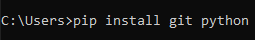
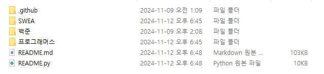
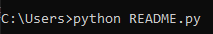
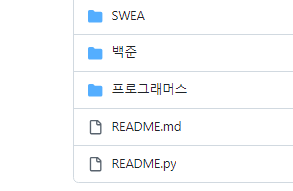
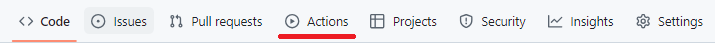
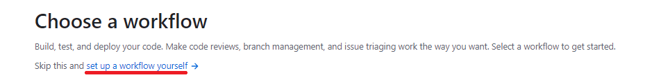
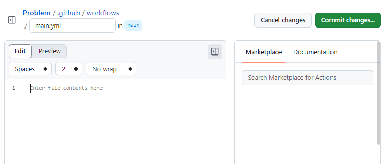
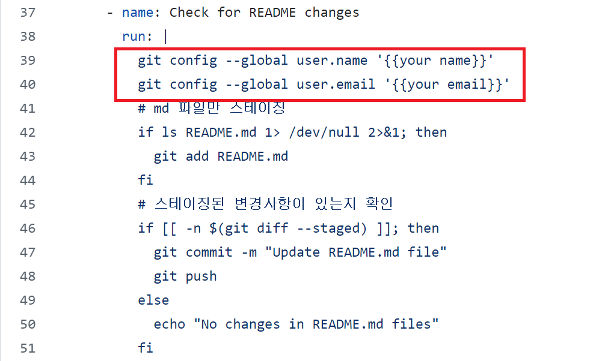
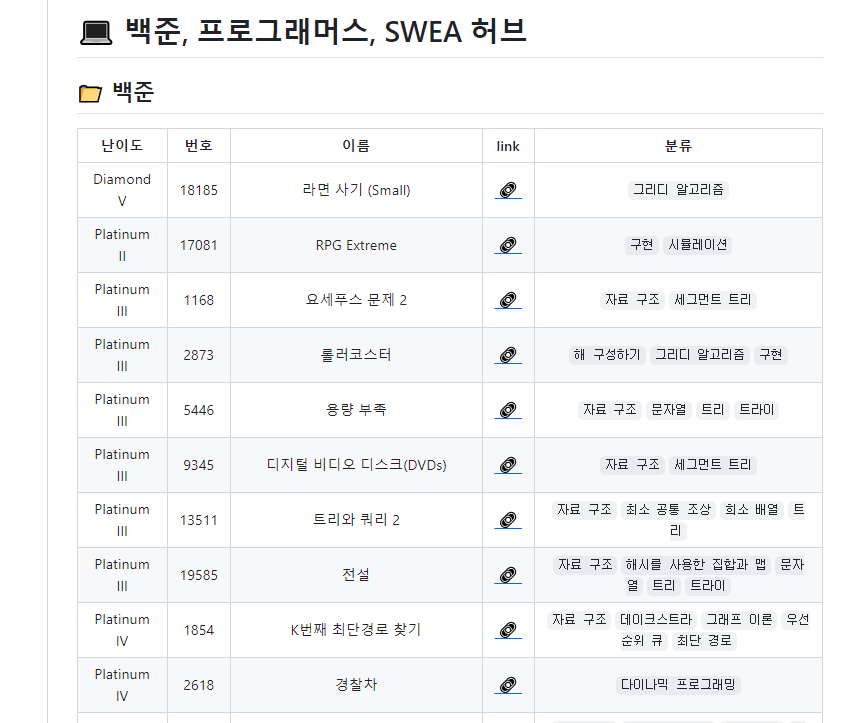

# Auto Make Readme 백준허브

## 배경

### [백준허브](https://github.com/BaekjoonHub/BaekjoonHub)

	백준 허브를 통해 백준, SWEA, 프로그래머스에서 정답을 제출했을 때,
	자동으로 Github에 Push 하여 관리할 수 있었다.
	
	추가로, GitAction으로 사용할 수 있는 .py파일을 제작하여
	Push 이후 Readme.md 파일에 새롭게 갱산하는 코드를 작성하였다.

	README.py 에는 2가지 버전이 숨겨져있다.
	
	인자 값을 통해 작동할 수 있다.

## Auto Make Readme 기능

1. 전체 폴더 탐색: python README.py all 또는 python3 README.py all
	<br/>
	
	<br/> git 관련 함수를 설치한다. 
	
	<br/> 백준 허브와 연동한 repo 폴더 안에 README.py를 놓는다.
	<br/>
	
	<br/> 코드(python README.py all) 또는 더블클릭으로 실행한다.

	local의 모든 폴더를 탐색하여, Readme.md가 생성된다. 이후 push한다.

	```
	이미 백준 허브를 구성한 유저가 Readme.md를 작성할 수 있도록 돕는 기능이다.
	import git 이 되어 있기 때문에
	pip install gitpython 을 통해서 git관련 함수를 설치해야 작동한다.

	이 코드를 실행하면 Readme.md 파일에 백준, SWEA, 프로그래머스 별 난이도, 문제번호로 정리한다.
	```

2. 변동 내역 탐색: python README.py changed 또는 python3 README.py changed
	
	<br/> 백준허브와 연동한 repo에 README.py를 업로드한다.
	1번을 수행했다면 이미 올라가 있을 것이다. 그렇지 않다면 clone 또는 직접 업로드한다.

	
	<br/> Actions을 클릭하여 gitaction에 들어간다.

	
	<br/> set up 글자를 클릭한다. 만약 다른 창이 뜨면, new workflow를 누른다.

	
	<br/> 이 안에 MD.yml 내용을 복사, 붙여넣기 한다.

	
	<br/> 당신의 name과 email로 내용을 변경한다. (your 부분) 중괄호도 제거한다.
	<br/> Commit changes.. 버튼을 누르고, 다시 한번 Commit changes를 눌러 마친다. 이후 push가 진행될 때마다 알아서 Readme를 갱신해줄것이다.

	```
	백준 허브와 연동된 repo에 업로드된 문제가 하나도 없거나, 1번을 수행한 이후에는
	2번 코드만 사용하면 된다.
	하지만, 2번은 로컬에서 직접 실행하지 않고, GitAction을 통해 작성하면 된다.

	GitAction은 github repo 메뉴탭에 있는 Actions를 통해 생성할 수 있으며,
	함께 올려둔 "MD.yml" 를 사용하면 된다.

	이를 통해 push 될 때마다 변경점을 확인하여, 사용자가 직접 README.md를 건들지 않고도
	백준허브가 Github에 올려준 문제들을 정리하여 README.md에 기록해준다.

	유의사항: GitAction이 잘 작동하기 위해서는, README.py 파일이 가장 상위 폴더에 있어야 한다. (단, yml을 수정하여 사용하면 커스텀 가능)
	```

3. 	MD.yml 사용법
	```
	1. 백준허브와 연동된 레포를 들어가 메뉴탭에 있는 Actions를 클릭한다.
	2. 왼쪽 Actions 옆에 있는 New workflow를 클릭한다.
	3. Choose a workflow 밑에 있는 "Skip this and set up a workflow yourself"를 클릭한다.
	4. MD.yml 내용을 붙여넣기 하기전, name: Check for README changes 탭에 run을 확인한다.
	5. git config --global user.name '{{your name}}'
       git config --global user.email '{{your email}}'
		를 자신에 맞게 변경한다. 
	6. MD.yml 안의 내용을 복사 붙여넣기한다.
	7. 제목을 잘 작성하고, Commit Changes를 눌러 마무리 한다.

	이제 Push 기록이 있을 때 마다, Readme를 관리해준다.
	```

### 트러블 슈팅

1. Gitaction에서 빨간색이 들어와요! 어떻게 하죠?
	```
	빨간색을 클릭하면 상세 정보를 볼 수 있는데, 2가지 상황이 있다고 생각한다.
	1. Run Python script에 빨간불이 들어온 경우
	 => README.py 에 문제가 발생한 것이기 때문에, 개발자인 저의 잘못이며 🙇 이슈를 남겨, 어떤 문제가 오류를 일으켰는지 알려주시면 수정하겠습니다.
	
	2. Check for README changes에 빨간불이 들어온 경우
	 => 보통은 Git confilct 문제가 가장 크기 때문에, gitaction을 끄고
	 1번을 수행하면 잘 진행될 것입니다. git pull (없다면 git clone)
	 이후, Readme.md 파일 삭제, Readme.py 실행, 이후 push

	 => 이외의 경우, issue를 남겨주셔도 사실, 개인 git의 문제일 가능성이 크기 때문에, 해결책을 제시하지 못할 수 있으니, 가능하시면 먼저 인터넷에 검색하시는걸 추천드립니다. 🙇
	```

## 다른 사람의 유용한 기능

[백준 허브 이미 풀었던 문제 시간 단축하기](https://velog.io/@exzile27/%EB%B0%B1%EC%A4%80%ED%97%88%EB%B8%8C-%EC%9D%B4%EB%AF%B8-%ED%92%80%EC%97%88%EB%8D%98-%EB%AC%B8%EC%A0%9C%EB%93%A4-%EB%AA%87-%EB%B6%84%EB%A7%8C%EC%97%90-%EC%98%AC%EB%A6%AC%EA%B8%B0)

-> 700개의 업로드를 자동화할 수 있었다.

**권고** : Gitaction을 켜둔채로, 몇십, 몇백개를 자동화하면 실행 순서가 꼬이기 때문에, git confilct가 계속 발생할 수 있다. (이메일이 700개 올수있다..)

그렇기 때문에, Gitaction을 꺼두고, 로컬에서 1번을 이용해 한번에 최신화시켜서
push 한 이후, Gitaction을 다시 키면 오류 없이 사용할 수 있다.

[깃허브 잔디에 물 주기](https://velog.io/@betterfuture4/%EA%B9%83%ED%97%88%EB%B8%8C-%EC%9E%94%EB%94%94%EC%97%90-%EB%AC%BC-%EC%A3%BC%EA%B8%B0feat.BaekjoonHub%EB%A1%9C-%EB%B0%B1%EC%A4%80-%EB%AC%B8%EC%A0%9C-%EC%9E%90%EB%8F%99-%EC%97%85%EB%A1%9C%EB%93%9C)

-> 구상 전 참고했던 블로그, 뼈대를 설계하는데 많은 도움이 되었다.

### 예제 사진




### 기타

이 파일은 Claude 3.5 및 다양한 자료 검색을 통해 제작했습니다.

